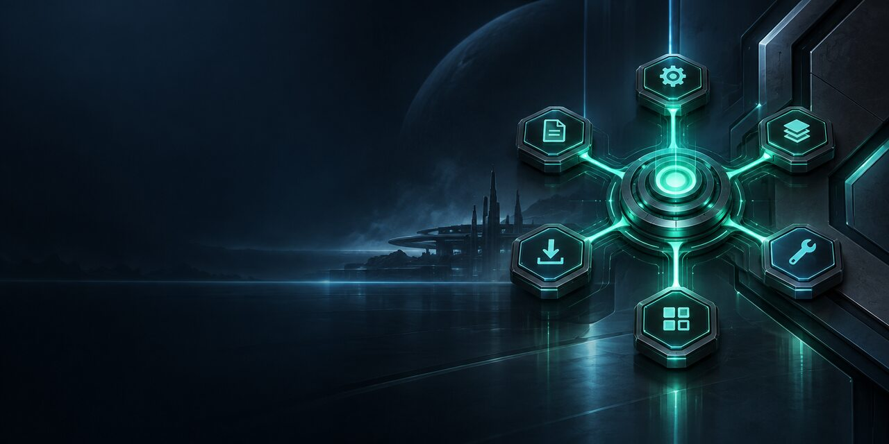
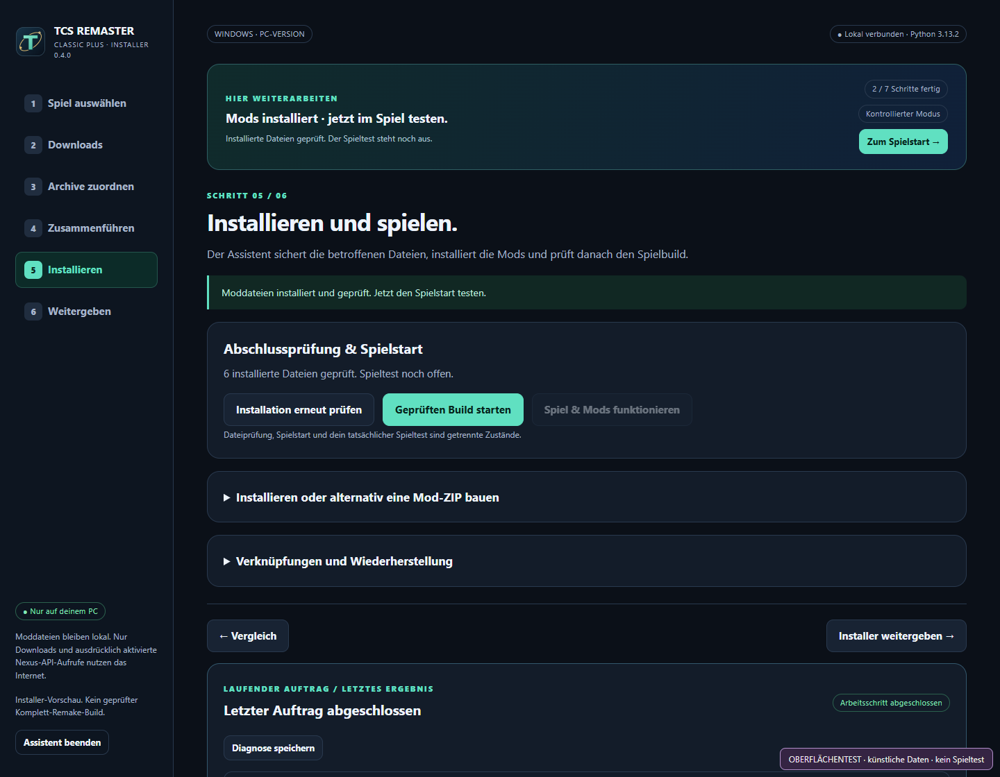

# TCS Remaster Installer

An unofficial, local Windows mod installer for **LEGO Star Wars: The Complete Saga**. It helps users prepare their own game copy, import archives downloaded from their original authors, review file conflicts, back up changed files, and verify the selected installation before launch.

**Status:** 0.4.0 technical preview. The project owner confirmed that one local installation and its mods work in game. Other mod variants and the full playtest checklist remain unverified. No game files or third-party mod archives are distributed here.

**[Download the installer](https://github.com/NorphyOG/tcs-remaster-installer/releases) · [German guide](README.md)**

## Get started

1. Extract the complete package outside the game directory.
2. Open `README.html` for the illustrated guide, then double-click `STARTEN.cmd` on Windows. `IM_BROWSER.cmd` opens the normal browser instead of the app window.
3. Select your own installed PC copy and confirm preparation. Use the displayed links to download the required files from the original author pages.
4. Leave completed archives in your chosen Downloads folder or in the installer's `mods` folder. The file comparison resolves known recipe overlays and safe text merges automatically, without per-file variant choices. Unknown versions stop with a report.
5. Verify the installed files, start the selected game copy, then test gameplay and mod behavior yourself.

Python 3.10 or newer is required. Nexus Premium is not required; free downloads still need confirmation on Nexus. ReShade and ASI runtimes require separate setup.

The full documentation is in the [German README](README.md), [getting started guide](docs/GETTING_STARTED.md), [test scope](docs/TESTING.md), and [publishing guide](docs/GITHUB_PUBLISHING.md). The [public source repository](https://github.com/NorphyOG/tcs-remaster-installer) belongs to [NorphyOG](https://github.com/NorphyOG). This tool is not affiliated with LEGO, Lucasfilm, Disney, TT Games, or Nexus Mods.
