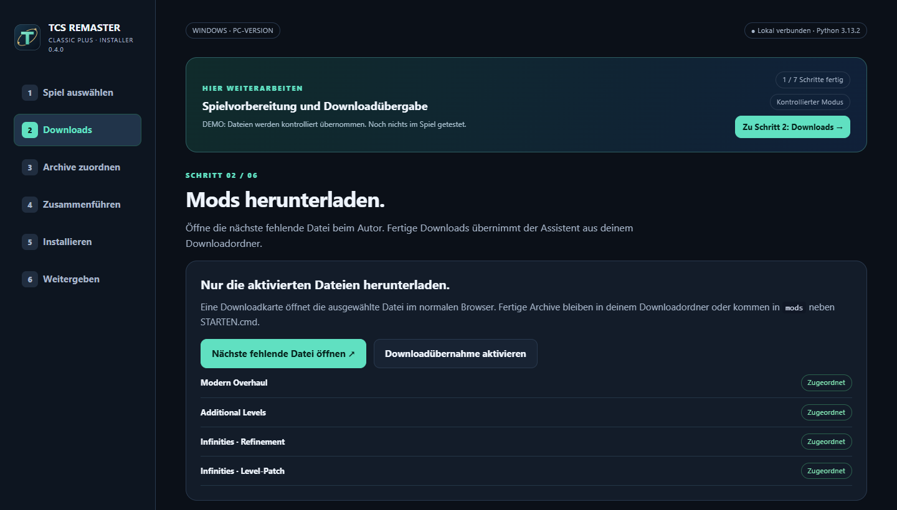

# TCS Remaster Installer

**Lokaler Windows-Modpack-Installer für LEGO Star Wars: The Complete Saga.**

**[Installer herunterladen](https://github.com/NorphyOG/tcs-remaster-installer/releases) · [Anleitung](docs/GETTING_STARTED.md) · [English overview](README.en.md)**

Downloads zuordnen, Originaldaten vorbereiten, Modkonflikte automatisch prüfen, Sicherungen anlegen und den ausgewählten Spielbuild starten. **Version 0.4.0 · technische Vorschau.** Keine Spiel- oder Moddateien enthalten. Der Nutzer hat eine lokale Installation mit Mods im Spiel bestätigt; weitere Varianten und die vollständige Playtest-Checkliste sind offen.

*Bild: Browserprüfung mit künstlichen Testdaten; kein Spiel-Screenshot.*

## In fünf Schritten starten

1. Die vollständige ZIP **außerhalb des Spielordners** entpacken, z. B. `Dokumente\TCS-Installer`. Nicht direkt in der ZIP starten.
2. `README.html` öffnen; anschließend **`STARTEN.cmd`** doppelklicken. Der Installer nutzt ein eigenes Edge-/Chrome-Appfenster. Alternativ: `IM_BROWSER.cmd`.
3. Deine eigene installierte PC-Kopie auswählen. Originalzustand und Werkzeugdownload einmal bestätigen. **„Vorbereiten + automatisch installieren“** starten.
4. **„Nächste fehlende Datei öffnen“** drücken und auf Nexus herunterladen. Der Assistent beobachtet nach Freigabe deinen gewählten Downloadordner **und `mods` neben `STARTEN.cmd`**. Nur vollständige passende Archive werden übernommen; nicht selbst entpacken.
5. Eindeutige passende Varianten werden zugeordnet. Unbekannte Fassungen oder echte Konflikte erfordern Prüfung. Nach Installation folgen SHA-256-Dateiprüfung und **„Geprüften Build starten“**. Die Mods anschließend im Spiel selbst kontrollieren.

**Zusammenführen läuft automatisch:** Der Dateivergleich übernimmt bekannte Autorendateien in dokumentierter Reihenfolge, regelt zehn geprüfte Text-/Skriptdateien über vollständige SHA-256-Werte und vereint weitere nicht überlappende Textänderungen mit bestätigter unveränderter Referenz. Du musst keine Variante pro Datei auswählen. Unbekannte Kombinationen stoppen sicher; der Prüfbericht nennt den Grund. [Regeln und Grenzen](docs/MOD_COMPATIBILITY.md).

*Bild: Browserprüfung mit künstlichen Testdaten; keine echten Mods.*

Ohne Nexus Premium bleiben die Downloadbestätigungen auf Nexus nötig. Kein Paywall-/Warteschlangen-Bypass. Nexus-Schlüssel sind optional und werden nur im RAM gehalten. ReShade-/ASI-Runtimes sind nicht Bestandteil der automatischen Dateninstallation.

## Update von 0.3.x – nichts neu herunterladen

Alten Assistenten und Spiel schließen → neue ZIP separat entpacken → **neue `UPDATE.cmd`** starten → **alten Installerordner** auswählen, nicht Steam → `JA`. Der Updater sichert Programmdateien; `.local`, `.runtime`, `mods` und bereits heruntergeladene Archive bleiben erhalten. Vorbereitete Spielarchive werden nicht allein wegen des Versionswechsels neu entpackt.

## Was 0.4.0 verändert

| Bereich | Umsetzung |
| --- | --- |
| Fortschritt | Sieben getrennte persistente Stufen; Dateizähler/Bytes nur bei bekannter Menge. Keine erfundene Gesamtzeit, kein pauschales 100 %. |
| Patchimport | Einheitliche Windows-/ZIP-Pfadnormalisierung; Größenvergleich **je Datei**, Fehler mit begrenzter Differenzliste. |
| Zuordnung | Gemeinsame Archivhüllen werden normalisiert. Classic/MO-Alternativen bleiben getrennt. Vader- und Additional-Levels-Patches sind verschiedene Module. |
| Downloadablauf | Öffnet die im Rezept ausgewählte Originaldatei; beobachtet Downloads und lokalen `mods`-Ordner. Unbekannte Versionen benötigen Prüfung. |
| Start | Prüft das Installationsjournal und startet die Original-EXE der ausgewählten Kopie, nicht pauschal eine andere Steam-Installation. |
| Fenster | Weboberfläche in eigenem Edge-/Chrome-Appfenster, eigenes Profil und Symbol; Browser-Fallback. Keine neue Browser-Runtime nötig. |
| Wiederherstellung | Geprüfte Zwischenstände, begrenzte Netzwerk-Wiederholungen, getrennte Sicherungen und kontrollierte Rücknahme. Keine beliebigen automatischen „KI-Fixes“. |

## Standardprofil und Erweiterungen

**Modern Overhaul → Additional Levels (Modern Overhaul) → Infinities Refinement / Classic Icons → Additional-Levels-Kompatibilitätspatch.**

Optional: **Ep3 Ch6 Addon + zugehöriger Vader-Enhancer-Patch** als zusammengehörige Erweiterung. Ein heruntergeladenes optionales Archiv wird erkannt, aber nicht ungefragt aktiviert. Nicht mehrere Icon-Stile übereinander installieren.

Dateiquellen, Versionen, Herkunft der Dateinummern und Abhängigkeiten stehen in [`profile.json`](profile.json), [`mod-audit.json`](mod-audit.json) und [Kompatibilität](docs/MOD_COMPATIBILITY.md). Ein bekannter Dateiname oder eine passende Nummer ist **kein Echtheitsnachweis**. Dateirezept zuletzt anhand öffentlicher Autorenlisten geprüft: 23.09.2026. Live-API-/Kontotests stehen aus.

## Voraussetzungen und Grenzen

Windows 10/11, eigene installierte TCS-PC-Kopie, ausreichend freier Platz für Originaldaten, Arbeitskopien und Backups. Python 3.10+; der Starter bietet eine lokale Runtime nach Bestätigung. Der Nutzer hat seine eigene Installation und die Modfunktion im Spiel bestätigt. Die synthetischen Tests decken nicht jede Modvariante, Runtime-Erweiterung oder Rücknahme ab. [Testumfang](docs/TESTING.md).

Der Installer patcht keine Spiel-EXE, lädt keine Crack-DLL, verteilt keine Spiel-/Modarchive und führt keinen importierten Modcode aus. Für Mods mit zusätzlichen Runtime-/EXE-Voraussetzungen ersetzt ein bestandener Datei-Abgleich **nicht** die Autorenanleitung oder einen Spieltest. [Sicherheit](SECURITY.md).

## Dokumentation

- [Installation und Update](docs/GETTING_STARTED.md) · [Automatik und Fortschritt](docs/AUTOMATION.md)
- [Moddateien und Varianten](docs/MOD_COMPATIBILITY.md) · [Fehler beheben](docs/TROUBLESHOOTING.md)
- [Architektur](docs/ARCHITECTURE.md) · [Mitentwickeln](CONTRIBUTING.md) · [Tests](docs/TESTING.md)
- [GitHub-Veröffentlichung](docs/GITHUB_PUBLISHING.md) · [Änderungen](RELEASE_NOTES.md)
- [Aktueller Prüfstand](docs/VERIFICATION_2026-09-24.md) · [Installationsbericht](docs/VERIFICATION_2026-09-23.md)

## GitHub und Rechte

Das [öffentliche Repository](https://github.com/NorphyOG/tcs-remaster-installer) enthält den eigenen Quellcode, Anleitung, künstliche Testbilder und Prüfsummen. Der Button **„Installer-ZIP erstellen“** exportiert nur Dateien der Positivliste; er lädt nichts selbst hoch. `.local`-Daten, Modarchive, Spielpfade, API-Schlüssel, Backups und Browserprofile gehören nicht in Issues oder Releases. CI und Vorlagen liegen unter `.github`.

**Rechte:** Eigenständiges, inoffizielles Community-Werkzeug, nicht von LEGO, Lucasfilm, Disney, TT Games oder Nexus Mods. Namen dienen der Beschreibung der Kompatibilität. Fremde Mods bleiben bei ihren Autoren; deren Rechte und Bedingungen gelten unverändert. Der eigene Quellcode steht unter [MIT](LICENSE); siehe [Credits](CREDITS.md).
